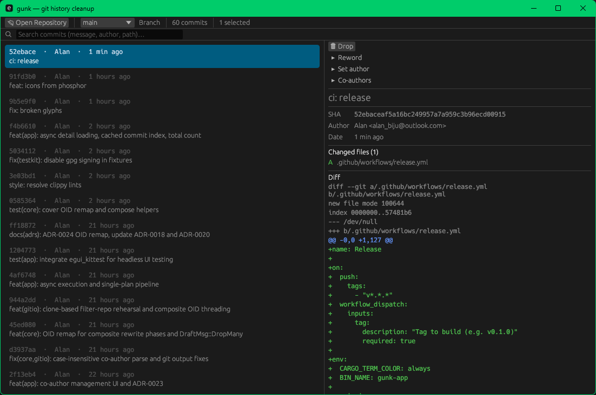

# gunk

**Clean up your Git history. Without fear.**

A cross-platform desktop app that opens a Git repository, lets you pick a branch, renders its history as a single linear list, and lets you clean it up safely — all in draft mode, with nothing touching your repo until you explicitly confirm.



## Features

- **Flatten merge commits** — Turn merge commits into ordinary commits so you can squash across them. The resulting tree is byte-identical to the original merge.
- **Squash & fixup** — Multi-select commits and squash them into one, or fixup to discard absorbed messages. Ctrl+click to select, then combine.
- **Rewrite messages & authors** — Edit commit messages, descriptions, and author info. Bulk-apply across multiple selected commits at once.
- **Reorder commits** — Drag commits into the order you wish they'd been made.
- **Remove files from history** — Strip sensitive or accidental files from the entire history. Optionally append them to `.gitignore`. Requires `git-filter-repo`.
- **Co-author management** — Add, edit, or remove `Co-authored-by` trailers across multiple commits.
- **Search** — Find commits by message, author, or filename. Search results are multi-selectable and bulk-editable.

## Safety

Every mutating apply follows a strict protocol:

1. **Draft mode** — All edits accumulate as a pending plan. Nothing touches your repo until you confirm.
2. **Rehearsal** — Every mutation is tested in a throwaway worktree first. If anything conflicts or fails, the real branch is untouched.
3. **Automatic backups** — A backup ref (`refs/gunk/backup/<branch>/<timestamp>`) is created before every rewrite. One-click restore.
4. **Push warning** — If you're rewriting commits that have already been pushed, gunk warns you before applying.
5. **Dirty-tree refusal** — Refuses to operate on a dirty working tree. Offers to auto-stash with explicit consent.

## Architecture

```
gunk/
├─ crates/
│  ├─ core/      # Pure domain model + plan engine. No IO. Unit-tested exhaustively.
│  ├─ gitio/     # IO layer. Thin typed wrapper over the git binary. Integration-tested.
│  ├─ testkit/   # Test-only: RepoFixture builder + assertions. dev-dependency.
│  └─ app/       # eframe/egui binary. Thin UI shell. No domain logic.
```

- `core` knows nothing about `git` or the filesystem. It takes an immutable snapshot of history plus user operations, validates them, and produces a concrete `ExecutionPlan`. Pure and deterministic — snapshot-tested with `insta`.
- `gitio` reads snapshots and executes `ExecutionPlan`s against real repos in tempdirs.
- `app` is a thin egui shell. UI state transitions are modeled as a testable reducer (`State × Msg → State`). No business logic lives in egui callbacks.

Operations are modeled as **data** (enum `Operation`), never as imperative git calls scattered through the UI.

## Build

Requires [Rust](https://www.rust-lang.org/tools/install) 1.85+ and [Git](https://git-scm.com/).

```bash
git clone https://github.com/waterrmalann/gunk.git
cd gunk
cargo build --release
```

## Run

```bash
./target/release/gunk-app
```

Opens the GUI. No config needed. Open a Git repo, pick a branch, and start cleaning.

## Optional dependency

[**git-filter-repo**](https://github.com/newren/git-filter-repo) — Required for the "remove files from history" feature. gunk detects it on startup and gracefully disables the feature if absent, with an actionable message.

## Test

```bash
cargo test --workspace        # ~240 tests across core, gitio, testkit
cargo clippy -- -D warnings  # must be clean
cargo fmt --check             # must be clean
```

## License

MIT
